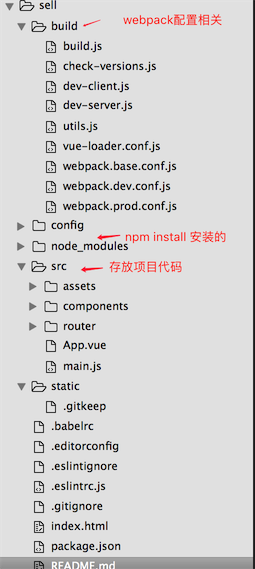

# 一级标题
## 二级标题
### 三级标题
#### 四级标题
##### 五级标题
###### 六级标题
1.command+需要的#数 可以打印出相应数量的标题

>（>）为区块引用符号  

连续按两个空格键为换行  
图片链接：  
    
居中  

  
制定宽高  

  

*   列表
*   列表
*   列表  
1.  Bird
2.  McHale
3.  Parish  
<ol>
<li>Bird</li>
<li>McHale</li>
<li>Parish</li>
</ol>  
**加粗**  
*斜体*
#### 第一章

1. 第一节
* 第二节(你不用敲 "2"，自动就有了）
    * 第一小节（推荐每层次缩进四个空格）
        * 小小节 1
        * 小小节 2
    * 第二小节  
  
---  
 （分割线）简书笔记是定位于写作者的一款写作软件，界面非常简洁，其最大的特色是支持 Markdown 功能，希望为作者制造出一种沉浸式的写作氛围，进而可以专注于写作。简书还支持写作模式，在简书·笔记中打开写作模式即可让撰写窗全屏化，再配合 Chrome 等浏览器的全屏浏览功能。简书·笔记能够达到与 Q10、MTW 之类的专心致志写作软件同样的效果。

   
----
