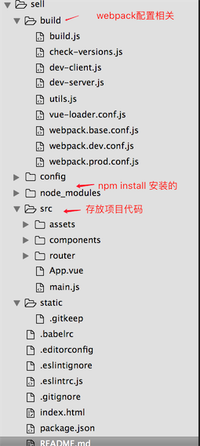

# 1.vue cli 脚手架
>  安装之后可以使用vue命令  
> 在使用vue init webpack 项目名 安装的项目之后其目录结构如下  

 

> src目录（主要代码）  
> assets目录（存放图片）  
> components目录（存放组件）  
> router目录（配置路由）  
> main.js（页面配置）  
> .babelrc babel配置文件，把我们ES6的代码通过它编译成ES5的。  
> .editorconfig 编辑器配置，字符码，缩进等   
> .eslintignore 忽略语法检查的目录文件配置 
> .eslintrc.js eslint的配置文件   
> .gitignore 配置上传git仓库时的忽略哪些文件   
> index.html 项目入口模板文件  
   

# 2.webpack 
>1. 提供热加载，改动代码，浏览器实时更新  
>2. 通过import router from '@/route/'这种方式实现导入，@路径可以在webpack.base.conf.js中设置  
>3. 在webpack.base.conf.js中可以配置后缀的省略。默认省略.js, .vue, .json文件的后缀。可以编辑添加新的后缀，在导入包时可以省略后缀。  
>4. 提供css modules，可以对css文件实现模块化管理  

# 3.vue-router 

###1.router-view为子组件挂载点   
    <router-view/>
给router-view设置的class，会直接作用到子组件的根元素上 
###2.hash模式与history模式： 
思否：https://segmentfault.com/q/1010000010340823/a-1020000010598395  
可以在router下index.js中开启history模式，默认是hash模式  
###3.router-link：
    let router = new VueRouter({
         mode: 'history',
         linkActiveClass: 'is-active',
  
a标签在hash模式要写#/about路径，在history模式下写/about，但是会出现刷新，想不刷新可以用router-link代替a标签，它会在渲染出的页面中变成a标签，但是会取消a标签的默认行为  

    <router-link exact to="/about" tag="div" event="mouseover">about</router-link>
router-link也可以使用tag指定渲染出的页面中编程的标签，无论指定什么标签，vue-router都会监听点击事件并且改变url为指定的  
linkActiveClass可以修改router-link的选中状态css  event="mouseover"标签中event改变默认触发事件  
exact 精确匹配路径，而不是包含父级路径
###3.重定向  
    {
      path: '*',
      //component: noFound
      // 重定向
      //redirect: '/home'
      //redirect: {path: '/home'}
      // redirect: {name: 'About'}
      redirect: (to) => {  //动态设置重定向的目标
        // 目标路由对象，就是访问的路径的路由信息

        if( to.path === '/123' ) {
          return '/home'
        }else if(to.path === '/456'){
          return {path: '/document'}
        }else{
          return {name: 'About'}
        }

        console.log(to)//打印出的是路由对象

      }
    },
当用户发出未定义路由，则可将其重定向到指定路由上
###4.挂载多个组件  

    <router-view name="slider"></router-view>
    <router-view class="center"></router-view>
    //设置两个router-view并且命名
    {
      path: '/document',
      name: 'Dcoument',
      components: {
        default: document,
        slider: slider
      }
    }
    在路由配置中分别给挂载点挂载组件
###5.$route对象与$router对象
1.router是VueRouter的一个对象，通过Vue.use(VueRouter)和VueRouter构造函数得到一个router的实例对象，这个对象中是一个全局的对象，他包含了所有的路由包含了许多关键的对象和属性。  
2.route是一个跳转的路由对象，每一个路由都会有一个route对象，是一个局部的对象，可以获取对应的name,path,params,query等  
$route.path   
字符串，等于当前路由对象的路径，会被解析为绝对路径，如 "/home/news" 。  
$route.params   
对象，包含路由中的动态片段和全匹配片段的键值对  
$route.query   
对象，包含路由中查询参数的键值对。例如，对于 /home/news/detail/01?favorite=yes ，会得到$route.query.favorite == 'yes' 。  
$route.router   
路由规则所属的路由器（以及其所属的组件）。  
$route.matched   
数组，包含当前匹配的路径中所包含的所有片段所对应的配置参数对象。  
$route.name   
当前路径的名字，如果没有使用具名路径，则名字为空。  
$route.hash   
当前路径的哈希值。如#abc。  
###5.history方法  
1.router.push(location)=====window.history.pushState  
想要导航到不同的 URL，则使用 router.push 方法。这个方法会向 history 栈添加一个新的记录，所以，当用户点击浏览器后退按钮时，则回到之前的 URL。  
2.router.replace(location)=====window.history.replaceState  
跟 router.push 很像，唯一的不同就是，它不会向 history 添加新记录，而是跟它的方法名一样 —— 替换掉当前的 history 记录  
3.router.back()====window.history.back()  
后退一步
4.router.forward()====window.history.forward()  
前进一步 
5.router.go()====window.history.go()  
指定前进或者后退的步数，正数为前进。负数为后退  

# 4.VueX
vuex主要用来解决在多层嵌套的组件之间传值的问题（小型项目不存在多层嵌套则不需要使用），以往用props反复传值在多层嵌套中太麻烦，vuex将需要管理的数据集中管理，需要改动或者获取是直接找store中的值即可，改动store的值会即时更新所有用到这个值的组件  
###1.state  
存放需要管理的数据，以对象形势存储,如果想获取数据，必须利用computed获取，利用this.$store访问到  
###2.Mutation  
如果想要更改state中的数据，必须通过提交Mutation来实现，在Mutation定义变更状态的函数，然后在需要时利用commit()提交，这个提交必须是同步的。  
###3.action  
如果想要异步提交Mutation，就必须要用action中定义函数去异步的提交commit()

    
vuex流程图  

###4.getter  
当两个地方a，b同时用到数据S，但是b对S有一定的限制，可以利用getter将S进行处理，生成新的数据D，而后可以利用store.getters.D获取D的数据  
###5.module
  
###6.辅助函数
...mapGetters  ...mapState ...mapActions ...mapMutations
...mapState(['count','count2'])
在组建中使用辅助函数简化操作  
# 4.axios  
基于promise的ajax请求，可以进行链式操作
      
   1.get请求
    

    axios.get('/user', {
    	params: {ID: 12345}
    }).then(function (response) {
    console.log(response);
    }).catch(function (error) {
    console.log(error);
    });
   2.post请求
    
    axios.post('/user', {
    firstName: 'Fred',
    lastName: 'Flintstone'
    })
    .then(function (response) {
    console.log(response);
    })
    .catch(function (error) {
    console.log(error);
    });
   3.同时多个请求
   
    function getUserAccount() {
	  return axios.get('/user/12345');
	 }
	
	 function getUserPermissions() {
	  return axios.get('/user/12345/permissions');
	 }
	
	 axios.all([getUserAccount(), getUserPermissions()])
	  .then(axios.spread(function (acct, perms) {
	    // 两个请求现在都执行完成
	 }));
   4.拦截器
   
    // 添加一个请求拦截器,请求之前拦截
    axios.interceptors.request.use(function (config) {
       // Do something before request is sent
       return config;
     }, function (error) {
       // Do something with request error
       return Promise.reject(error);
     });

	// 添加一个响应拦截器，请求之后拦截
	axios.interceptors.response.use(function (response) {
	    // Do something with response data
	    return response;
	  }, function (error) {
	    // Do something with response error
	    return Promise.reject(error);
	  });

  

 

